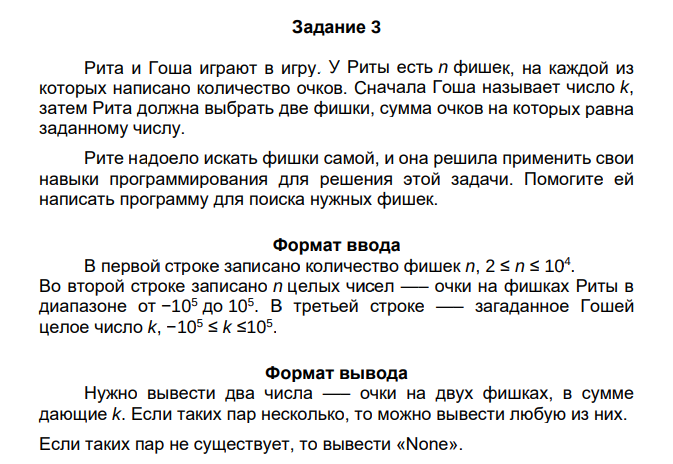
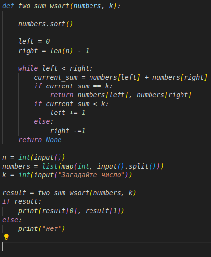

# Лабораторная 3
## Задание:


## Мой код:


# Что запомнить?
```numbers = list(map(int, input().split()))
```

input - прочел строку

.split() - разбил по пробелам
map(int) - превратил каждую строку в число
list  -собрал все в список

```
while left < right:
        current_sum = numbers[left] + numbers[right]
        if current_sum == k:
            return numbers[left], numbers[right]
        if current_sum < k:
            left += 1
        else:
            right -=1
    return None
```

сама сортировка

1. задали сумму очков
2. если у нас попытка удачная, мы возвращаем 2 номера фишки
3. если меньше: сдвигаем левую границу на 1 вправо
4. иначе: правую на 1 влево